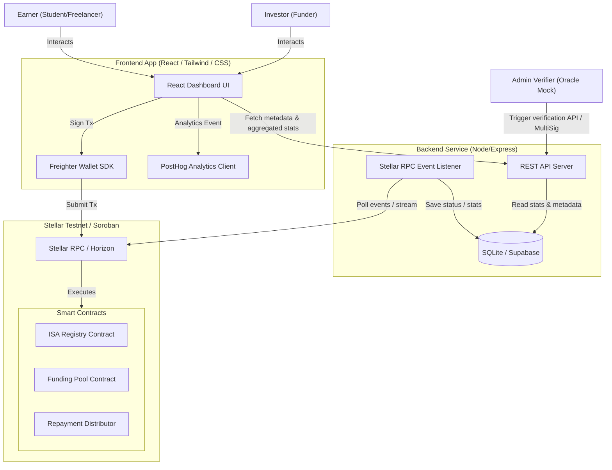

# SkillFi System Architecture

SkillFi is a decentralized Income-Share Agreement (ISA) platform on Stellar. The platform comprises a React frontend integrated with Freighter wallet, a Soroban smart contract suite, a lightweight indexer/API backend, and user analytics.

---

## Architecture Diagram

This diagram visualizes how the different layers of the SkillFi stack interact with each other and with the Stellar network.

---

## Detailed Component Breakdown

### 1. Frontend Layer
*   **Technology**: React / Next.js, custom modern glassmorphic CSS styling.
*   **Wallet Integration**: `@stellar/freighter-api` handles public key retrieval and transaction signing.
*   **Analytics**: PostHog integration to track client interactions (`wallet_connected`, `isa_created`, `investment_submitted`, `repayment_submitted`).

### 2. Smart Contract Layer (Soroban / Rust)
*   **ISA Registry/Factory**:
    *   Maintains a global registry of all created ISAs.
    *   Stores core metrics: Target Funding, Income Pledged %, Repayment Cap, and Earner address.
    *   Emits `isa_created` events.
*   **Funding Pool**:
    *   Accepts deposits of Stellar Assets (SAC-wrapped USDC/native token).
    *   Mints and tracks share ownership tokens representing investors' proportional rights.
    *   Releases funds to the Earner upon reaching the goal.
    *   Emits `invested` and `funded` events.
*   **Repayment Distributor**:
    *   Manages payments from the Earner.
    *   Calculates distribution shares by querying the corresponding Funding Pool's ledger records.
    *   Executes payment transfers to investors.
    *   Enforces safety limits (e.g. repayment cap and contract duration).

### 3. Backend & Indexer Layer
*   **Technology**: Node.js, Express, `stellar-sdk`.
*   **Event Indexer**: Periodically polls Stellar RPC (`getEvents` method) to capture SkillFi events. It processes `isa_created`, `invested`, and `repayment_distributed` to keep state up-to-date.
*   **API Service**: Serves cached global telemetry (Total Value Locked, total funded, repayment progress) and stores off-chain details (Earner bios, verification proofs) in SQLite/Postgres.
